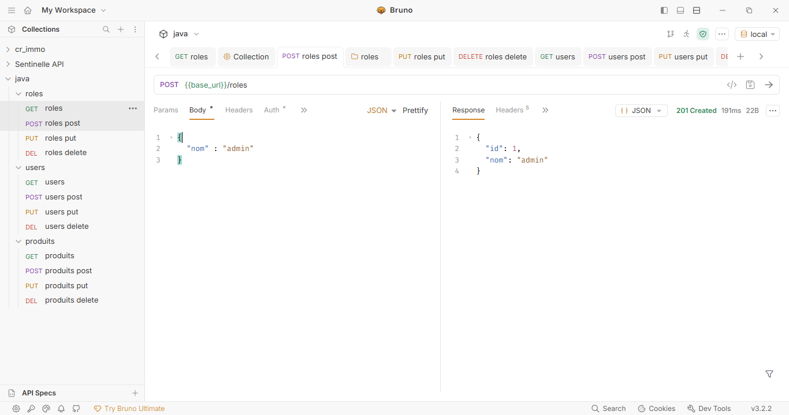
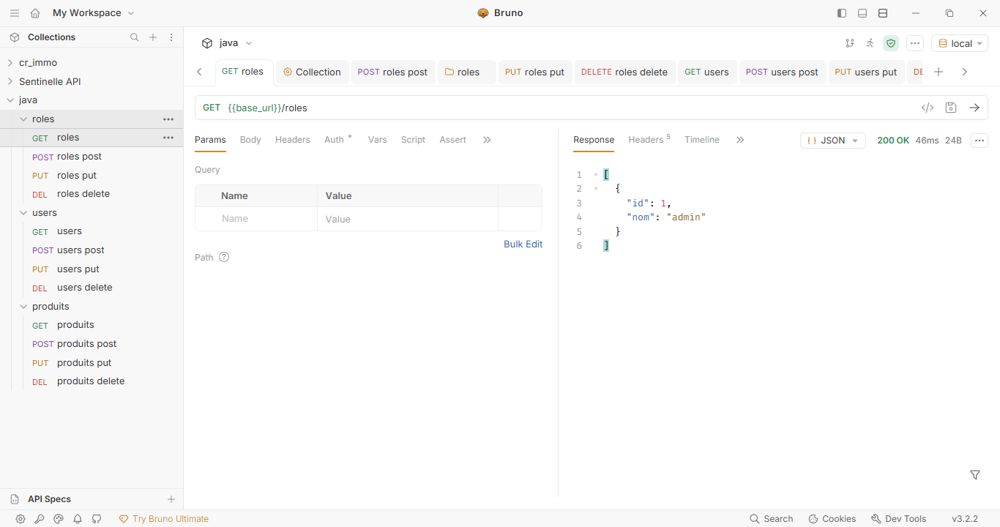
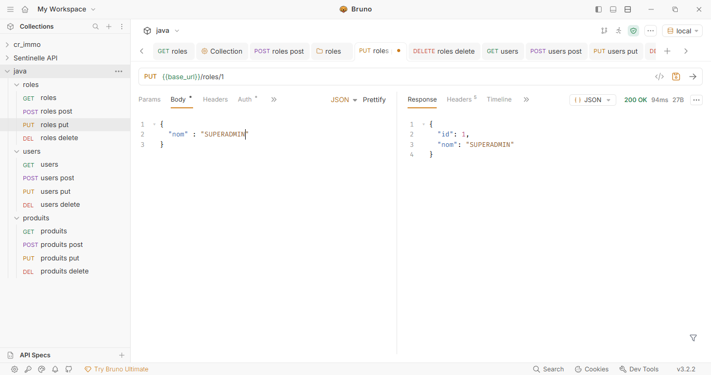
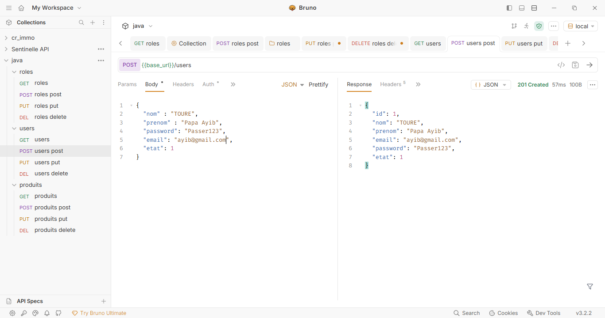
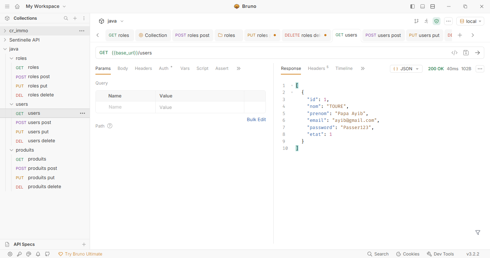
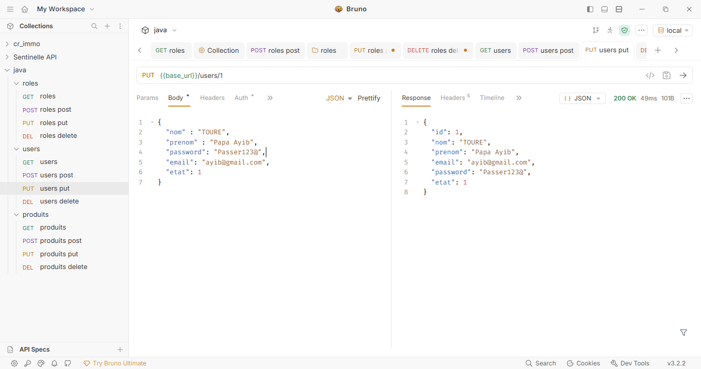
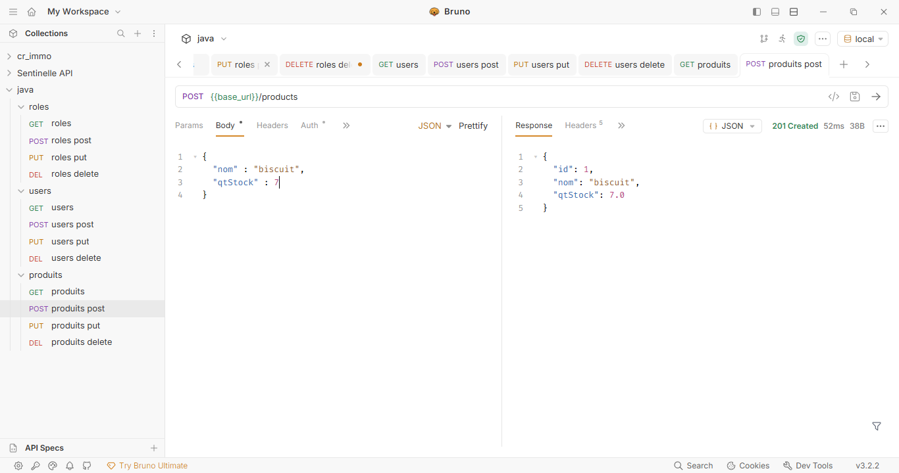
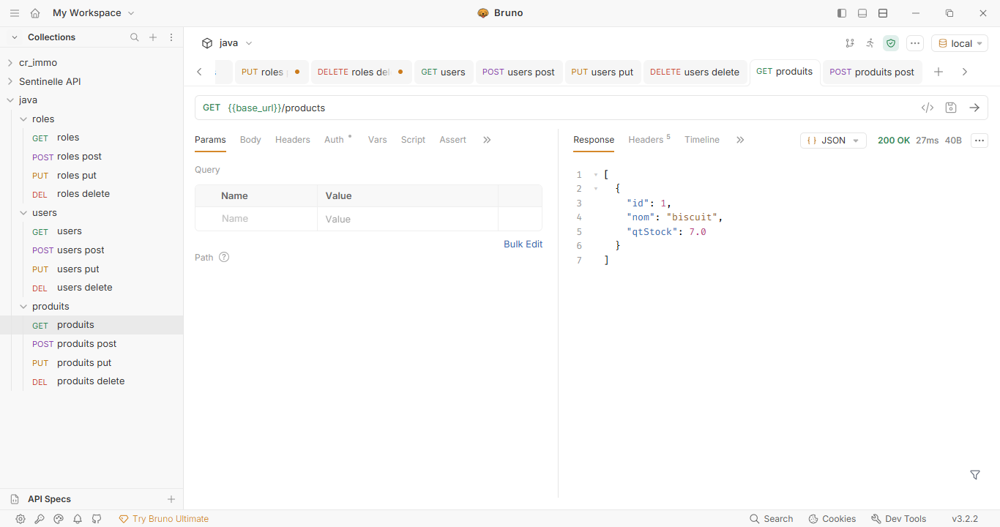
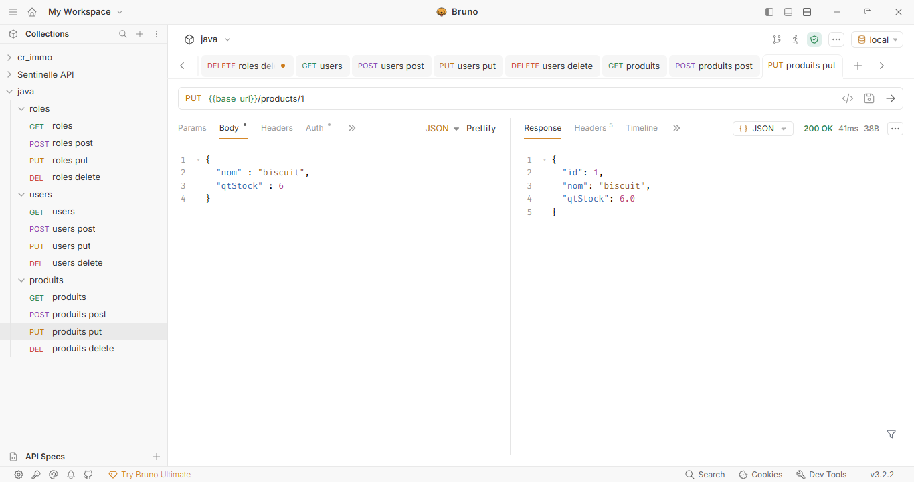

## Prérequis

- **Java 17** ou supérieur
- **Maven 3.6+**
- **MySQL 8.0+**
- **Redis 6.0+** (optionnel si caching activé)

## Dépendances Principales

### Framework & Web
- **Spring Boot 4.0.2** : Framework web complet
- **Spring Boot Starter Web** : Support REST API
- **Spring Boot Starter Actuator** : Monitoring et health checks

### Persistance & Base de Données
- **Spring Boot Starter Data JPA** : ORM Hibernate
- **Spring Boot Starter Flyway** : Migrations de base de données
- **MySQL Connector J** : Driver MySQL JDBC
- **Flyway MySQL** : Support Flyway pour MySQL

### Caching
- **Spring Boot Starter Data Redis** : Intégration Redis pour le caching

### Mapping & Validation
- **Lombok 1.18.36** : Génération de boilerplate code (getters, setters, constructors)
- **MapStruct 1.5.5.Final** : Mapping objet entre DTOs et entités
- **Jakarta Validation API 3.0.2** : Validation des données

### Testing
- **Spring Boot Starter Test** : JUnit 5, Mockito, AssertJ
- **Spring Boot Starter Flyway Test** : Testing avec Flyway
- **AssertJ 3.27.7** : Assertions fluides pour les tests
- **H2 Database** : Base de données en mémoire pour les tests

### 1. Préparer l'environnement avec docker
```bash
docker compose up
```

### 2. Installation dépendances

```bash
mvn clean install
```

## Configuration de l'Environnement

Éditer le fichier `src/main/resources/application.properties` ou définir les variables d'environnement :

```properties
# Base de données MySQL
spring.datasource.url=jdbc:mysql://localhost:3306/tp_spring_boot?createDatabaseIfNotExist=true&useUnicode=true&useJDBCCompliantTimezoneShift=true&useLegacyDatetimeCode=false&serverTimezone=UTC
spring.datasource.username=user
spring.datasource.password=user123
spring.datasource.driver-class-name=com.mysql.cj.jdbc.Driver

# Hibernate / JPA
spring.jpa.hibernate.ddl-auto=update
spring.jpa.show-sql=true

# Flyway (migrations)
spring.flyway.baseline-on-migrate=true
spring.flyway.enabled=true

# Redis
spring.data.redis.host=localhost
spring.data.redis.port=6379

# Logging
logging.level.org.springframework.web=DEBUG
logging.file.name=logs/logs.log
```

### Variables d'environnement personnalisées :

```bash
export DB_HOST=localhost
export DB_NAME=tp_spring_boot
export DB_USERNAME=user
export DB_PASSWORD=user123
```

## Démarrer l'Application

### Développement (Maven)

```bash
mvn spring-boot:run
```

L'application démarre sur `http://localhost:8080`

### Depuis le JAR compilé

```bash
mvn clean package
java -jar target/tp_spring_boot-0.0.1-SNAPSHOT.jar
```

### Avec Docker Compose

```bash
docker-compose up -d
```

## Points d'Accès

- **Accueil** : `http://localhost:8080/`
- **Gestion des roles api** : `http://localhost:8080/roles`
- **Gestion des users api** : `http://localhost:8080/users`
- **Gestion des products api** : `http://localhost:8080/products`
- **Health Check** : `http://localhost:8080/actuator/health`
- **Info App** : `http://localhost:8080/actuator/info`
- **Métriques** : `http://localhost:8080/actuator/metrics`

## Structure du Projet

```
src/main/
├── java/com/groupeisi/tp_spring_boot/
│   ├── TpSpringBootApplication.java      # Classe principale
│   ├── config/                            # Configuration Spring
│   │   ├── ApplicationConfig.java        # Beans personnalisés
│   │   ├── RedisConfig.java              # Configuration Redis
│   │   └── LoggingAspect.java            # AOP pour logging
│   ├── controller/                        # REST Controllers
│   ├── service/                           # Logique métier
│   ├── dao/                               # Repositories JPA
│   ├── dto/                               # Data Transfer Objects
│   ├── entities/                          # Entités JPA
│   ├── exception/                         # Gestion des exceptions
│   └── mapping/                           # Mappers MapStruct
└── resources/
    ├── application.properties             # Configuration
    └── db/migration/                      # Scripts Flyway
        └── V1__Init_db.sql               # Schéma initial
```
## Test des api avec Bruno
- Gestion des roles
  
  
  
- Gestion des users
  
  
  
- Gestion des products
  
  
  

## Exécuter les Tests

```bash
mvn test
```

Les rapports de test sont générés dans `target/surefire-reports/`

## Scripts de Migration Flyway

Les migrations SQL sont situées dans `src/main/resources/db/migration/`

Nommage convention Flyway :
- `V1__Init_db.sql` → Migration initiale
- `V2__Add_new_table.sql` → Migration 2

## Notes

- **Lombok** génère automatiquement les getters, setters et constructors
- **MapStruct** crée les mappers entre entités et DTOs à la compilation
- **Flyway** exécute automatiquement les migrations au démarrage
- **Redis** est utilisé pour le caching (optionnel)
- **Actuator** expose les endpoints de monitoring
